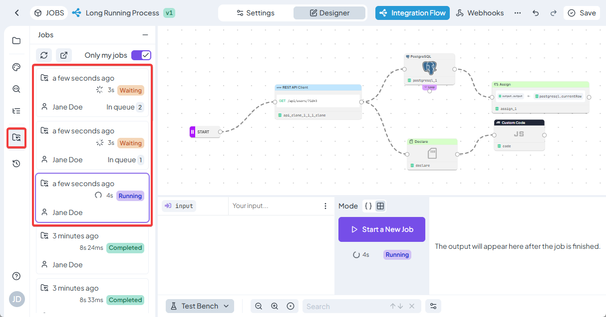

# Jobs

_Jobs_ are another name for a long running process that evaluates Flows of rules that are triggered via Integration Flow.

The main difference to the typical rule evaluation, where the rule is triggered via REST API and the caller is waiting for the response, is that when the Integration flow is triggered a background Job is created for the evaluation that the caller doesn’t wait for. A Job waits in a queue until it is ready to be evaluated and then starts its evaluation, it can then run for an indefinite amount of time (unlike a typical rule it is not limited by the rule timeout).


Discover differences between Integration Flow and Decision Flow in dedicated article: [Decision Flow vs. Integration Flow](../rules/flow/decision-flow-vs.-integration-flow.md)


As mentioned above, the only way to use jobs for evaluation of rule is to use Integration Flow.

### Managing Jobs

All job for a particular space are available in the _Jobs_ menu accessible from the Homepage via Space-> Jobs.

<figure><figcaption></figcaption></figure>

In the list you will see all the executed jobs with some basic information and most importantly their state, you can also cancel a job in this menu if you want to interrupt its execution.

In an Integration Flow, the left-hand menu "Jobs" shows a list of jobs running for the selected rule. When you click on a job, you can see its current execution details in the designer. If the job has already finished, you will instead see its output, logs, and other execution details.

<figure><figcaption></figcaption></figure>

### Jobs states

The jobs can be in one of the states based on the following list

* <mark style="color:$warning;">Waiting</mark>
  * The job is created and waiting in a queue to start the execution
* <mark style="color:purple;">Running</mark>
  * The job is currently being executed
* <mark style="color:$success;">Completed</mark>
  * The job finished its execution and return the output data
* <mark style="color:$danger;">Error</mark>
  * Something went wrong during the execution and the job failed to finish
* <mark style="color:$info;">Canceled</mark>
  * The job was manually interrupted
* <mark style="color:$primary;">Cancelling</mark>
  * The job is currently being terminated

### Counting Jobs executions and billing

The jobs executions are billed according to the amount of **time spent** on their executions (unlike typical API calls which are billed based on the amount of calls made).

Your account has a certain number of free seconds that can be spent executing jobs (this can be monitored in the [Profile Dashboard](../profile/dashboard.md) of your account under Jobs - current usage), any executed jobs will count towards this limit.

#### Pay as you go - disabled

If the limit is reached and pay as you go is disabled, the system will prohibit you from starting any new Jobs executions, **but all the currently triggered jobs will be completed and any time over the limit will not be billed.**

#### Pay as you go - enabled

If the limit is reached and pay as you go is enabled, then the executions continue and the time is billed accordingly.


More about Pay-As-You-Go option in Profile section [here](../profile/pay-as-you-go.md).

