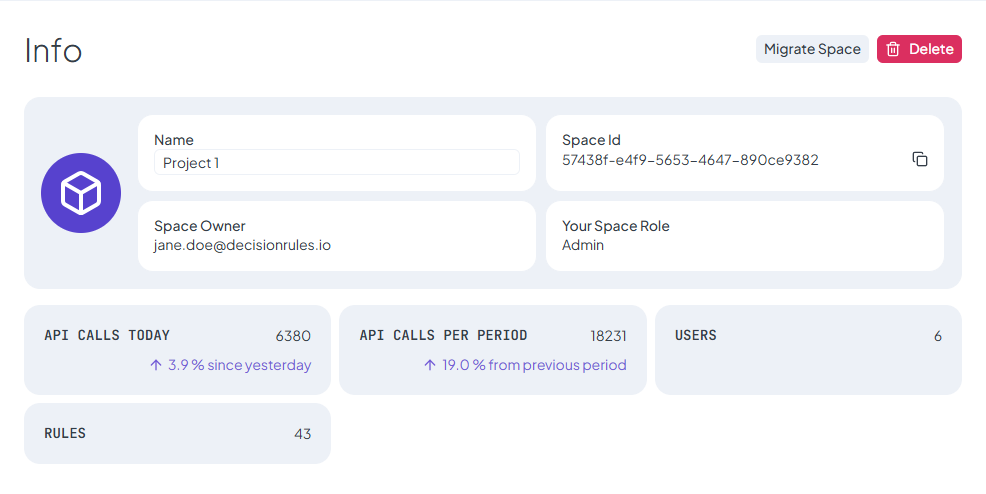

# Space Info

The **Space Info** page provides a detailed overview of the selected space, displaying essential details that help you manage and identify it. This section allows you to monitor key attributes of the space, including user access, API key usage, and rule count.

<figure><figcaption></figcaption></figure>

### **Space Details**

This section includes fundamental information about the space:

* **Name** - The assigned name of the space, which can help distinguish it from others.
* **Space ID** - A unique identifier used to reference the space, often needed for API calls and integrations.
* **Space Owner** - The user who owns the space and has the highest level of control, including managing settings, users, and permissions.
* **Organization** - The organization to which the space belongs, typically representing a company or team using the platform.
* **Your Space Role** - Your assigned role within the space, defining what actions and features you are allowed to access. Shows on private spaces.
* **Number of Users** - Displays the total number of users who have access to the space, helping administrators manage permissions effectively.
* **Number of Rules** - Shows the total number of rules created within the space, helping track its complexity and usage.
* **Number of API Calls Today and Per Period** - Displays the number of API requests executed today and within the current billing period, helping monitor usage.

### **Removing a Space**

If a space is no longer needed, you have the option to delete it using the **Remove Space** button. This action **permanently deletes** the space along with all its associated data, including rules and API keys, other users permissions. <mark style="color:red;">Since this process</mark> <mark style="color:red;"></mark><mark style="color:red;">**cannot be undone**</mark><mark style="color:red;">, it should be performed with caution.</mark> Only users with the necessary permissions can remove a space.
