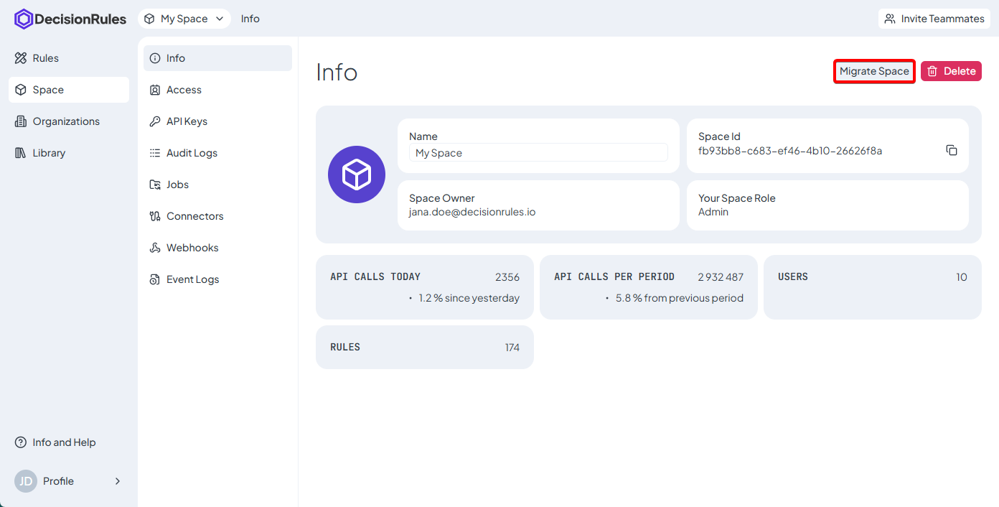
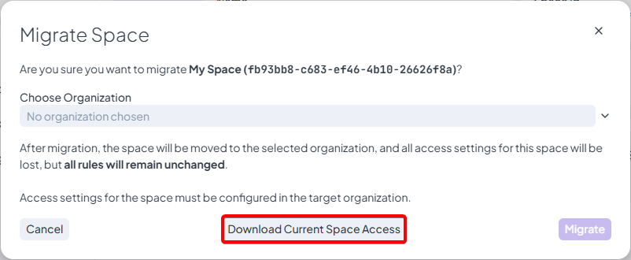
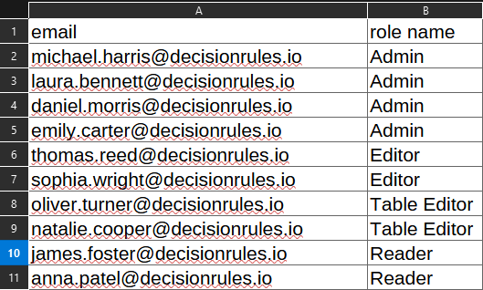
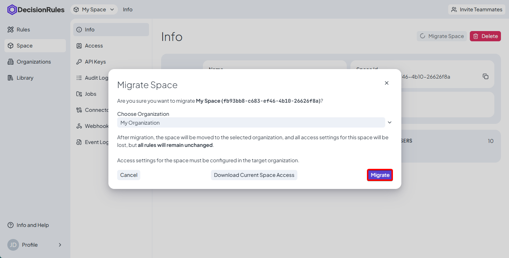
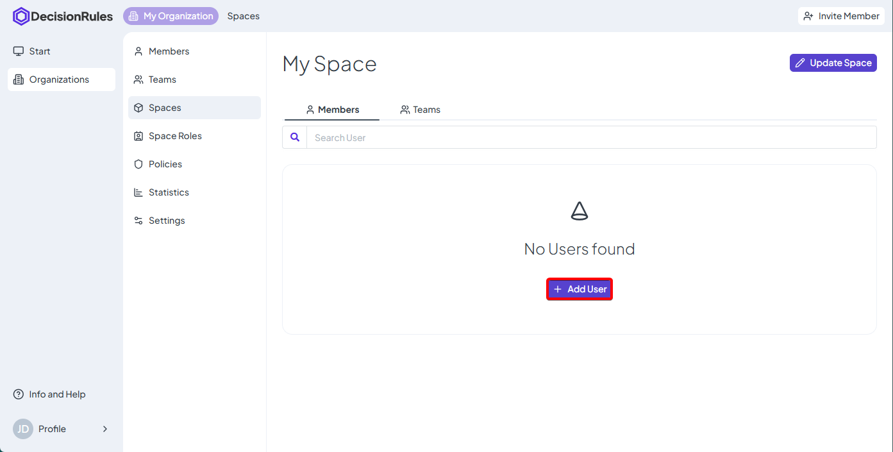

# Space migration

<figure><figcaption></figcaption></figure>

### Availability

The Space Migration option is available only if:

* You are the Owner of the private space
* You are a Billing Owner in at least one organization

If these conditions are met, the migration option will be visible in the Space Info page.

### How Space Migration Works

#### 1. Start Migration

When you click the Migrate Space button:

* A modal dialog is displayed
* You can select the target organization from a list of organizations where you have billing ownership

#### 2. Download Current Space Access (Optional)

<figure><figcaption></figcaption></figure>

Before confirming the migration, you can download the current access configuration of the space.

* This downloads a CSV file
* The file contains:
  * email
  * role (default and custom)
* One row per user who currently has access to the space

This is useful as a reference, since space-level access settings will not be preserved after migration.

<figure><figcaption></figcaption></figure>

#### 3. Confirm Migration


Access permissions are not migrated


Once confirmed:

* The space is moved under the selected organization
* All rules and configurations remain unchanged
* All space access settings are removed

<figure><figcaption></figcaption></figure>

### After Migration

#### Access Configuration

* Access to the space must be reconfigured at the organization level
* Permissions are managed using the organization’s access controls

#### Redirection

After the migration is completed:

* You are automatically redirected to the organization
* The system opens the space detail page
* You can immediately set access permissions for the migrated space

<figure><figcaption></figcaption></figure>
