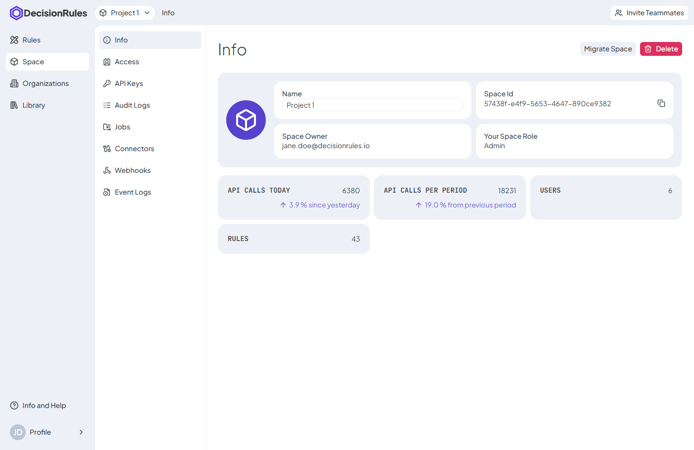
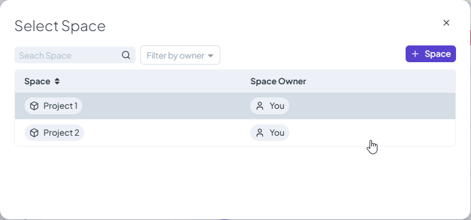
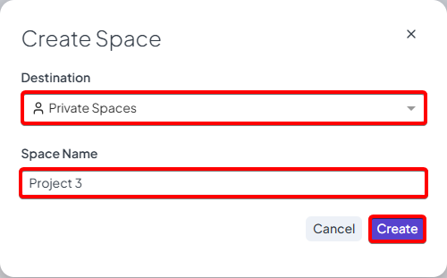

# Space Introduction



Spaces allow you to work together with your team in DecisionRules and to create the rules together. It's easy and time-efficient to edit or create your rules. :rocket:

### Getting started

After logging in, the rule list is displayed. The active space is shown in the top-left corner. To view its details, click **Space** in the left-hand menu and the **Space Info** screen will open.

<figure><figcaption>
Space Selector
</figcaption></figure>


The number of spaces depends on[ **the product plan**](https://www.decisionrules.io/pricing/public-cloud)


### Change your space

If you want to change your space you are in, click on the Space selector, modal window will show up with your spaces you can choose from.

<figure><figcaption>
Change Space Dialog
</figcaption></figure>

### Create new space

Create a new space from the **Select Space** modal using the "**+Space**" button. Select the owner (you or an eligible organization), enter the space name, and confirm by clicking **Create**. The space is created instantly.

<figure><figcaption></figcaption></figure>

<figure><figcaption></figcaption></figure>

