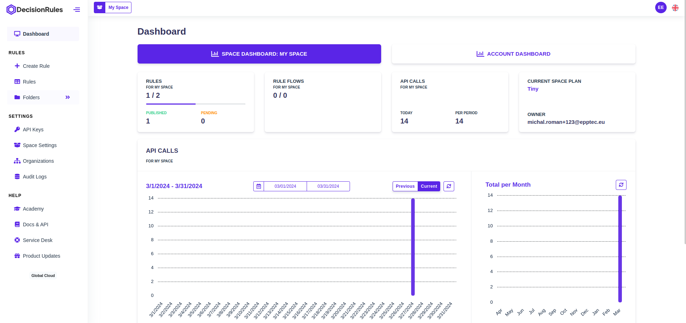
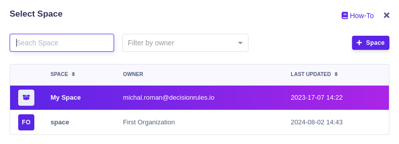

# Space Introduction



Spaces allow you to work together with your team in DecisionRules and to create the rules together. It's easy and time-efficient to edit or create your rules. :rocket:

### Getting started

Log in to your account and, your dashboard will show up. In the top right corner, you can see which space you are in right now.

<figure><figcaption>
Space Selector
</figcaption></figure>


The number of spaces depends on[ **the product plan**](https://www.decisionrules.io/pricing/public-cloud)


### Change your space

If you want to change your space you are in, click on the Space selector, modal window will show up with your spaces you can choose from.

<figure><figcaption>
Change Space Dialog
</figcaption></figure>
