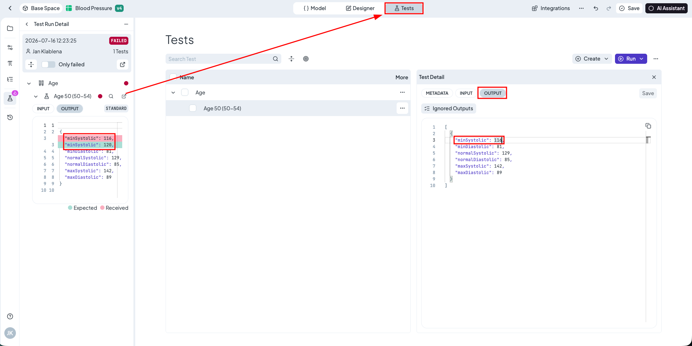

# Test Runs Tab

The Test Runs view displays a complete history of test executions across the entire space.

### Test Runs Overview

The main table provides a high-level summary of all executions. It includes the following columns:

* Tested at: Timestamp of the execution.
* Resource: The specific rule tested. _(If a run contains Test Suites from multiple rules, this displays as "Multiple Rules")._
* Run by: The user or system that initiated the run.
* Execution time: Total duration of the run.
* Status: Passed, Failed, Error, or Canceled.
* Results: A numerical breakdown of passed suites, failed suites, and errors.

<figure><figcaption></figcaption></figure>

### Test Run Detail

Clicking anywhere on a Test Run row opens its detailed view (except the name). Alternatively, clicking directly on the Resource Name will navigate you straight to that specific rule.

The detailed view provides comprehensive information about the specific test execution, including:

* When the test was executed.
* Who initiated the run.
* Total execution time.
* Overall execution status.
* The number of rules involved.

#### Available Actions

Inside the Test Run detail, users can perform the following actions:

* Run Test Again: Instantly re-executes the same test run.
* Inspect: Accessible via the three-dot menu icon. This action navigates directly to the specific rule in Inspect Mode, allowing you to view a detailed, side-by-side comparison of the expected output versus the received output.


#### Use of inspect

The Inspect tool is specifically designed for debugging failed tests, as it highlights the exact discrepancies causing the failure.


<figure><figcaption></figcaption></figure>

### Inspect / Debug Test

When a test fails, it indicates a mismatch between the rule's current behavior and the test's expected output. A typical scenario is intentionally updating a rule's logic (e.g., modifying a decision table), which causes existing tests to fail because they still expect the old values.

Here is the standard workflow to debug and resolve a failed test:

#### 1. Enter Inspect Mode

From the Test Run details, click the Inspect icon next to the failed test.

* This action redirects you directly to the rule with dedicated test run opened
* Inspect Mode is automatically activated (indicated by the highlighted magnifying glass icon).

<figure><figcaption></figcaption></figure>

#### 2. Compare the Outputs

In Inspect Mode, the test's original input is automatically loaded and processed. To understand exactly why the test failed, navigate to the Output tab.

* The interface displays a side-by-side comparison.
* It visually highlights the differences between the Expected Output (from your saved test) and the Received Output (what the updated rule actually generated).

<figure><figcaption></figcaption></figure>

#### 3. Resolve the Discrepancy

If the new Received Output is correct and the failure is simply due to an outdated test (e.g., the test expected `116`, but the new correct value is `120`), you need to update the saved test.

1. Click the Redirect Arrow icon next to the Inspect view.
2. This will navigate you directly to the Tests tab, with that specific failing test already opened for editing.

<figure><figcaption></figcaption></figure>

### 4. Update the Expected Output

1. Inside the opened test details, locate the Expected Output JSON payload.
2. Manually rewrite the outdated value to match the new correct behavior (e.g., update `116` to `120`).
3. Click Update.
4. The test is now updated and will pass successfully on the next run.
