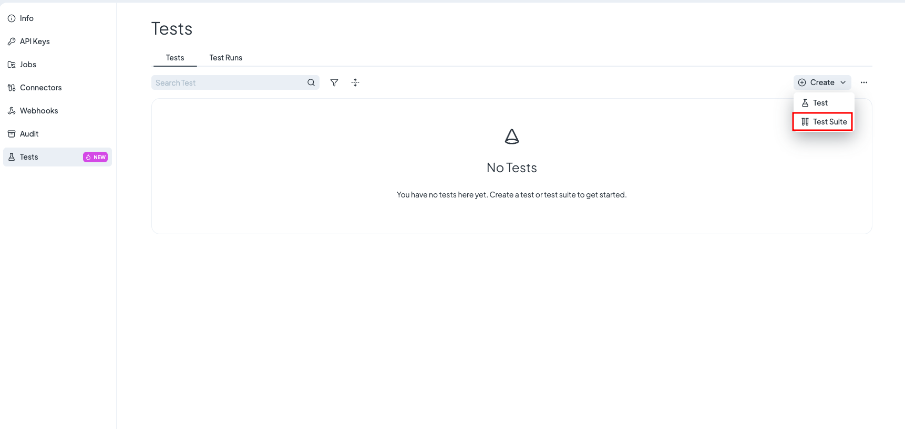
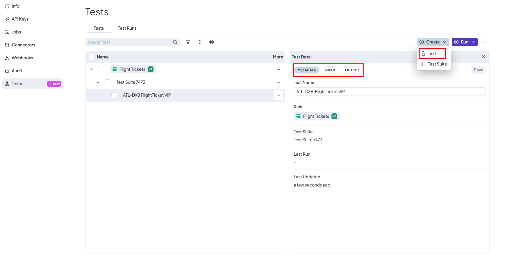

# Tests Tab

The Tests tab is your central workspace for organizing, managing, and executing test data. Here, users can view the entire testing hierarchy, create new Test Suites and Tests, reorganize existing items, and trigger test executions.

### Structure and Selection

The interface uses an expandable structure containing:

* Rules
* Test Suites
* Tests


#### Better management

Selection operates via checkboxes. Selecting a parent item automatically selects all of its descendants.


### Create Test Suite

Users can create new Test Suites directly from this tab to prepare testing structures for existing rules.

1. Click the Create button.
2. Select Test Suite.
3. Select target Rule.
4. Click Create Test Suite.

<figure><figcaption></figcaption></figure>

### Creating a Test&#x20;

The process for creating a Test is similar but requires defining the specific test scenario:

1. Click the Create button.
2. Select Test.
3. In the modal window, choose the Rule and Test Suite _(Note: The Test Suite must be created beforehand)_.
4. Configure your test details in the respective tabs:
   * Metadata tab: Update the test name.
   * Input tab: Define the input parameters and strategy.
   * Output tab: Review or configure the expected outputs.
5. (Optional) Configure Ignored Outputs: Use this to exclude dynamic values—such as current timestamps or generated IDs—that would otherwise cause false validation failures.
6. Click Save.

<figure><figcaption></figcaption></figure>


#### Best Practice

While you can create tests manually on this page, we highly recommend creating tests directly from the Test Bench during rule development for a more efficient workflow. Learn more about this approach in the [Rule Testing](../../rules/common-rule-features/rule-testing/) documentation.


### Running Tests

Users can trigger test executions directly from this view:

1. Select the desired Tests or Test Suites using the checkboxes.
2. Click Run selected to execute only the chosen items.
3. _(If no items are selected, you can click Run all to execute all tests visible in the structure)_

### Moving Tests and Test Suites&#x20;

You can easily reorganize your tests and suites using two methods:

* Drag and Drop: Quickly move or reorder individual tests and test suites directly within the interface.
* Dropdown Menu: To move an entire Test Suite to a different rule, open the suite's detail view and select the target rule from the dropdown menu.

### Cloning (Copying)

Copy actions allow users to reassign tests or Test Suites to a different rule.

1. Select the desired test or Test Suite.
2. Click Clone

### Orphaned Tests

Orphaned Tests occur when the stored rule alias and version do not match any existing rule in the space.

* They are displayed in the space-level menu.
* Users can resolve them by selecting the orphaned tests and using the Move action to assign them to an existing rule.
