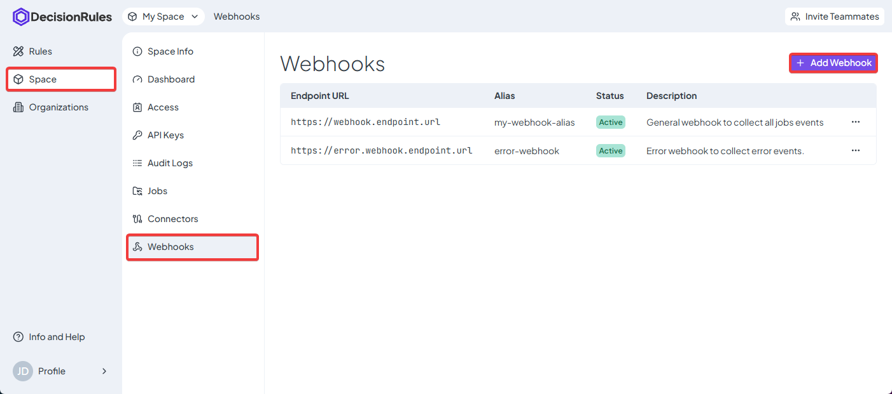
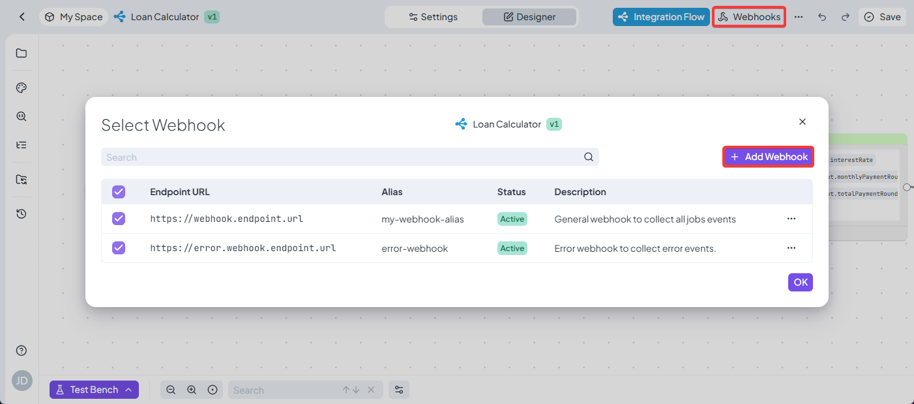
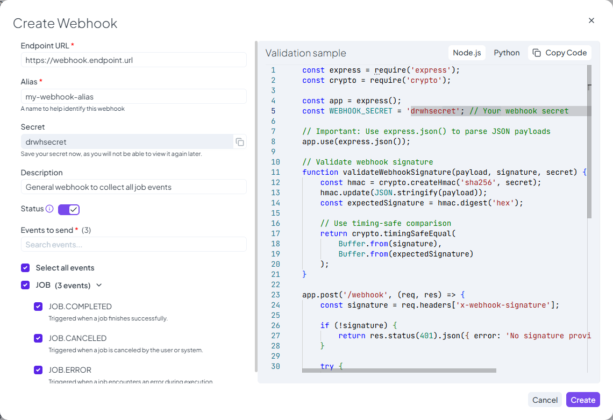
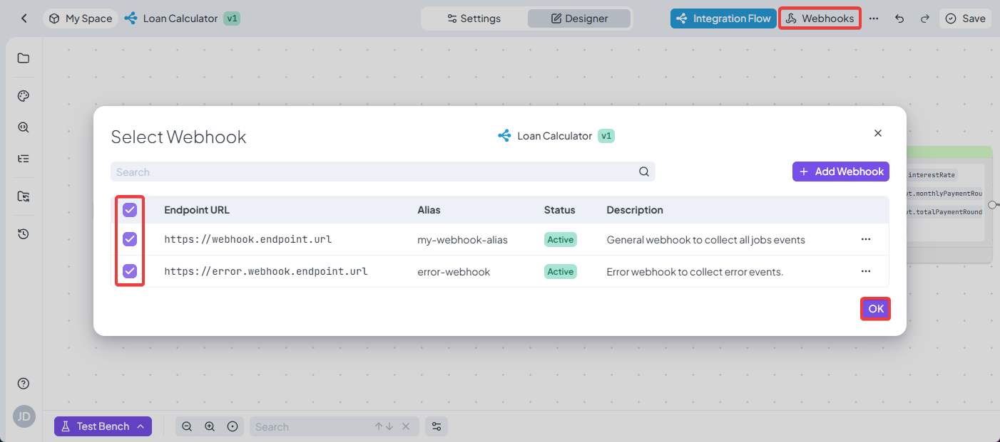

# Webhooks

Webhooks are a way to receive notifications and output data from finished jobs running in DecisionRules. This information can either be retrieved manually via the provided [Jobs API endpoint](../api/jobs-api.md) or a webhook can be set up that receives the information automatically upon the Job’s completion.

## How to define a webhook

A new webhook can be defined after navigating into the menu under Space → Webhooks and clicking the “+ Add Webhook” button, or while in an Integration Flow using the “Webhooks” button in the top-right corner.

<figure><figcaption>
Access to Webhooks page
</figcaption></figure>

<figure><figcaption>
Create a Webhook in Rule Designer
</figcaption></figure>

For any new webhook you can fill out the following:

* Endpoint URL _(Required)_
* Alias _(Required)_
  * Identification of the webhook inside DecisionRules
* Status
  * Switch to turn off the webhook without the need of deleting it
* Description _(Optional)_
* Events to send _(Required)_
  * You can select which type of events will this webhook be triggered for, for example you can have separate webhooks for successful executions and another one for cancellations and errors

<figure><figcaption>
Create a new webhook screen
</figcaption></figure>

### Secret

While setting up the webhook you are provided with a secret that can be used to verify incoming messages.


Please note that the secret is shown only in the creation of the webhook and **is not accessible anywhere else**.


### Validation Sample

In the webhooks creation screen you are also provided with implementation examples, that highlights the retrieval and verification of the message.&#x20;

### Assigning webhook to specific rules

When you have your webhook created inside DecisionRules you then have to link it to specific rules so that their completion events are reported.

This can be done for any Integration Flow, using the top right menu “Webhooks” and checking all the created webhooks you want to send the events to.

<figure><figcaption>
Add Webhook to rule
</figcaption></figure>

### Testing Webhook functionality

If you need to test the webhook functionality, or want to see the resulting messages without having to setup the webhook yourself, we would recommend one of the sites that allow you to setup a testing webhook online (e.g., webhook.site).

For this test all you need to do is to take the provided URL, set up a DecisionRules webhook using that URL (nothing else has to be set up), turn on the specific webhook for your Integration Flow and after running a Job you should see a message received with all of the provided data in the service that you are using.
