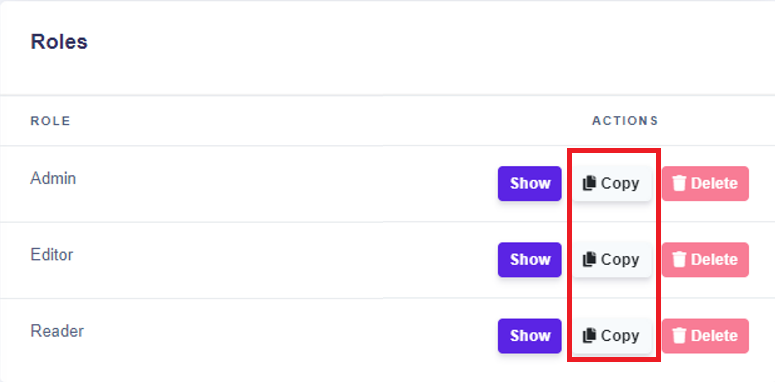

# Advanced Permissions

## **How to get started**

Advanced permissions are hidden in the settings of the space you want to manage. There are two options for how to get to the settings. Both options are listed on the left in the main menu. Click on the option which is under “Selected Space”, or just simply hit the button Space. Then in the opened window choose in which space you want to manage permissions of all users in the space and click on the button .

## **Settings of the Space**

Settings of the spaces are divided into three parts. In the upper part of the settings is an overview of the space. In the middle part of the site, you can see the list of users who have access to the space. The last third part is dedicated to the Roles of users in the space, where you are managing the advanced permissions.


In case you are the owner of the Space, the only role you can have is Admin.


### **Add or remove users**

To add another user to your space, just hit the button and enter the email of your colleague or somebody with whom you want to collaborate in the space. In case you don’t want some user in the space, just click on the button .


When adding another user to the Space, the default role of that user is Editor. After the user accepts the invitation, you are able to easily change his/her role to another one.


### **Roles**

In the last section of the setting of the space have listed the roles. Each permission role allows users to interact in the space in different ways:

* **Admin** - has full access to all features and is allowed to do all actions
* **Editor** - has almost full access to all features, excluding changes in Space and its permissions
* **Reader** - is allowed just to view the data and settings in each feature

.png>)

To see more details about each role, click on the button .png>) . It will appear in the window with the settings of the permissions role you chose.


It is not possible to delete the default roles. You are able to delete just the roles you have created.


### **Admin Permissions**

Settings of the roles are done in the window called “Admin permissions”. Those admin permissions are divided into basic rules permissions and permissions of each feature in the DecisionRules such as:

* Decison Tables
* Scripting Rule
* Rule Flow
* Test Bench
* API Key
* Space

&#x20;Which permissons have each feature is described in [Overview of Role permissions.](advanced-permissions.md#overview-of-role-permissions)

.png>)


It is important to keep in mind that superiority exists between permissions. This for example means that if the user doesn't have permission to update the rule, the user is not able to save the changes he/she has done.


### **Create a new role**

In case you want to create your own role with selected permissions, the first thing you need to do is to **** copy ".png>)" one of the default roles. Then name the new role and choose the permission for this created role.


When you copy any of the default roles, the new role will have the same permissions as the copied default role. The difference is that in the default role you are not allowed to do any changes, but in the new role you can set up the permissions you want.


### Overview of Role permissions

#### Basic permissions

| Permission                |         Admin        |        Editor        |        Reader        |
| ------------------------- | :------------------: | :------------------: | :------------------: |
| Create Rule               | :white\_check\_mark: | :white\_check\_mark: |                      |
| Delete Rule               | :white\_check\_mark: | :white\_check\_mark: |                      |
| Update Rule               | :white\_check\_mark: | :white\_check\_mark: |                      |
| View Rule                 | :white\_check\_mark: | :white\_check\_mark: | :white\_check\_mark: |
| Clone Rule                | :white\_check\_mark: | :white\_check\_mark: |                      |
| Rename Rule               | :white\_check\_mark: | :white\_check\_mark: |                      |
| Clone Rule to space       | :white\_check\_mark: | :white\_check\_mark: |                      |
| Copy Rule to space        | :white\_check\_mark: | :white\_check\_mark: |                      |
| Export Rule               | :white\_check\_mark: | :white\_check\_mark: |                      |
| Import Rule               | :white\_check\_mark: | :white\_check\_mark: |                      |
| Edit Input & Output model | :white\_check\_mark: | :white\_check\_mark: |                      |
| Edit Description          | :white\_check\_mark: | :white\_check\_mark: |                      |
| View Rule settings        | :white\_check\_mark: | :white\_check\_mark: | :white\_check\_mark: |
| View Rule history         | :white\_check\_mark: | :white\_check\_mark: | :white\_check\_mark: |

#### Decision Table

| Permission          |         Admin        |        Editor        |        Reader        |
| ------------------- | :------------------: | :------------------: | :------------------: |
| View Decision Table | :white\_check\_mark: | :white\_check\_mark: | :white\_check\_mark: |
| Add Row             | :white\_check\_mark: | :white\_check\_mark: |                      |
| Add Condition       | :white\_check\_mark: | :white\_check\_mark: |                      |
| Add Result          | :white\_check\_mark: | :white\_check\_mark: |                      |
| Edit Cell           | :white\_check\_mark: | :white\_check\_mark: |                      |
| Delete Row          | :white\_check\_mark: | :white\_check\_mark: |                      |
| Delete Condition    | :white\_check\_mark: | :white\_check\_mark: |                      |
| Delete Result       | :white\_check\_mark: | :white\_check\_mark: |                      |
| Rename Condition    | :white\_check\_mark: | :white\_check\_mark: |                      |
| Rename Result       | :white\_check\_mark: | :white\_check\_mark: |                      |
| Set Valid Values    | :white\_check\_mark: | :white\_check\_mark: | :white\_check\_mark: |
| Set Filter          | :white\_check\_mark: | :white\_check\_mark: | :white\_check\_mark: |
| Set Sort            | :white\_check\_mark: | :white\_check\_mark: | :white\_check\_mark: |

#### Scripting Rule

| Permission          |         Admin        |        Editor        |        Reader        |
| ------------------- | :------------------: | :------------------: | :------------------: |
| View Scripting Rule | :white\_check\_mark: | :white\_check\_mark: | :white\_check\_mark: |

#### Rule Flow

| Permission                |         Admin        |        Editor        |        Reader        |
| ------------------------- | :------------------: | :------------------: | :------------------: |
| Create Rule Flow          | :white\_check\_mark: | :white\_check\_mark: |                      |
| Update Rule Flow          | :white\_check\_mark: | :white\_check\_mark: |                      |
| Delete Rule Flow          | :white\_check\_mark: | :white\_check\_mark: |                      |
| View Rule Flow            | :white\_check\_mark: | :white\_check\_mark: | :white\_check\_mark: |
| Clone Rule Flow           | :white\_check\_mark: | :white\_check\_mark: |                      |
| Rename Rule Flow          | :white\_check\_mark: | :white\_check\_mark: |                      |
| Edit Input & Output model | :white\_check\_mark: | :white\_check\_mark: |                      |
| Edit Description          | :white\_check\_mark: | :white\_check\_mark: |                      |
| View Rule Flow settings   | :white\_check\_mark: | :white\_check\_mark: | :white\_check\_mark: |
| Change Mapping            | :white\_check\_mark: | :white\_check\_mark: |                      |
| Delete Mapping            | :white\_check\_mark: | :white\_check\_mark: |                      |
| Change Global Variable    | :white\_check\_mark: | :white\_check\_mark: |                      |
| Add Start                 | :white\_check\_mark: | :white\_check\_mark: |                      |
| Add End                   | :white\_check\_mark: | :white\_check\_mark: |                      |
| Add Rule                  | :white\_check\_mark: | :white\_check\_mark: |                      |
| Change Rule               | :white\_check\_mark: | :white\_check\_mark: |                      |

#### Test Bench

| Permission     |         Admin        |        Editor        |        Reader        |
| -------------- | :------------------: | :------------------: | :------------------: |
| Run Test Bench | :white\_check\_mark: | :white\_check\_mark: | :white\_check\_mark: |

#### API Key

| Permission     |         Admin        |        Editor        |        Reader        |
| -------------- | :------------------: | :------------------: | :------------------: |
| View API Key   | :white\_check\_mark: | :white\_check\_mark: | :white\_check\_mark: |
| Create API Key | :white\_check\_mark: | :white\_check\_mark: |                      |
| Delete API Key | :white\_check\_mark: | :white\_check\_mark: |                      |
| Rename API Key | :white\_check\_mark: | :white\_check\_mark: |                      |

#### Space

| Permission        |         Admin        |        Editor        |        Reader        |
| ----------------- | :------------------: | :------------------: | :------------------: |
| View Space        | :white\_check\_mark: | :white\_check\_mark: | :white\_check\_mark: |
| Add User          | :white\_check\_mark: |                      |                      |
| Delete User       | :white\_check\_mark: |                      |                      |
| Change permission | :white\_check\_mark: |                      |                      |
| Add Rile          | :white\_check\_mark: |                      |                      |
| Delete Role       | :white\_check\_mark: |                      |                      |
| Rename Space      | :white\_check\_mark: |                      |                      |
| Delete Space      | :white\_check\_mark: |                      |                      |
| View Users        | :white\_check\_mark: | :white\_check\_mark: | :white\_check\_mark: |
| View Invitations  | :white\_check\_mark: | :white\_check\_mark: | :white\_check\_mark: |
| View Roles        | :white\_check\_mark: | :white\_check\_mark: | :white\_check\_mark: |
| Update Space      | :white\_check\_mark: | :white\_check\_mark: |                      |
| Delete Invitation | :white\_check\_mark: | :white\_check\_mark: |                      |

