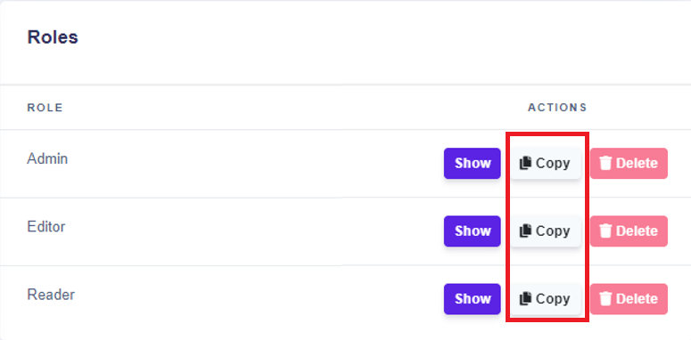

# Users & Roles

## **Manage advanced permissions**

Advanced permissions are hidden in the settings of the space you want to manage. There are two options for how to get to the settings.

* Either click the  (1).png>) button in the top right, then click the  icon on the rule you wish to manage.

or

* &#x20;Simply hit the **Users & Roles** button in the sidebar.

<figure><figcaption></figcaption></figure>

### **Settings of the Space**

Settings of the spaces are divided into three parts. In the upper part of the settings is an overview of the space. In the middle part of the site, you can see the list of users who have access to the space. The last third part is dedicated to the Roles of users in the space, where you are managing the advanced permissions.

<figure><figcaption></figcaption></figure>


In case you are the owner of the Space, the only role you can have is Admin.


### **Add or remove users**

To add another user to your space, just hit the button and enter the email of your colleague or somebody with whom you want to collaborate in the space. In case you don’t want some user in the space, just click on the button .


When adding another user to the Space, the default role of that user is Editor. After the user accepts the invitation, you are able to easily change his/her role to another one.


### **Roles**

In the last section of the setting of the space have listed the roles. Each permission role allows users to interact in the space in different ways:

* **Admin** - has full access to all features and is allowed to do all actions
* **Editor** - has almost full access to all features, excluding changes in Space and its permissions
* **Reader** - is allowed just to view the data and settings in each feature

.png>)

To see more details about each role, click on the button  (1) (1) (1).png>) . It will appear in the window with the settings of the permissions role you chose.


It is not possible to delete the default roles. You are able to delete just the roles you have created.


### **Admin Permissions**

Settings of the roles are done in the window called “Admin permissions”. Those admin permissions are divided into basic rules permissions and permissions of each feature in the DecisionRules such as:

* Decison Tables
* Scripting Rule
* Rule Flow
* Test Bench
* API Key
* Space

 (1) (1).png>)


It is important to keep in mind that superiority exists between permissions. This for example means that if the user doesn't have permission to update the rule, the user is not able to save the changes they has done.


### **Create a new role**

In case you want to create your own role with adjustable permissions, click the  button. You will be prompted to enter a name for the new Role. A new Role will be created with all permission settings deselected.&#x20;

Another option is to **Copy** an existing Role. To do this, click the  button next to the Role you wish to build upon and choose a name for the new Role.


When you copy any of the default roles, the new role will have the same permissions as the copied default role. The difference is that in the default role you are not allowed to do any changes, but in the new role you can set up the permissions you want.

