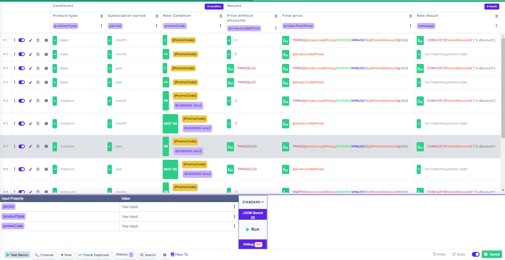
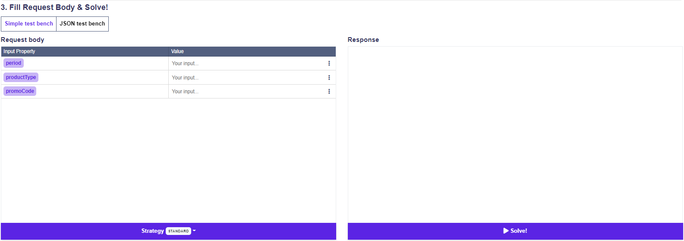
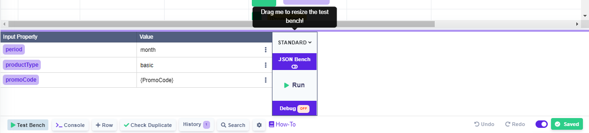

# Simple Test Bench

### Used in Rule

### Used in test bench component

### Resizeable

Drag the purple line up to resize the test bench.

### Filling input


If you want to use comma inside the input field, please put the whole word in double quote marks.

E.g. "some,text"



The reason for having to put text with comma inside quote marks is that if you write 1,2,3 as input in the simple test bench, it will be interpreted as an array(list) on the backend.&#x20;

E.g. 1,2,3 would be converted to \[1,2,3]


### Date Input

You can input by clicking on the three dots .

Then click on the date icon  (1).png>).

Then a modal will popup .

 (1).png>)

Choose the date, time and time zone (only the time zone is required) and click save.

If you decide to change the date, you can simply click on the input that will change color on hover.


To clear the input simply click on the mentioned three dots  (1).png>) and then click on clear (1).png>).


### Preset Values

In case that the rule used inside the simple test bench is a Decision Table, you can use preset values to fill out the input. The main aim is to minimize typing errors and speed up the process of testing a rule.

To use the preset values feature click on the three dots .

Then click on the .png>)option.

A popup modal will be presented to you with all the values that are used inside the column that corresponds to the input property.

.png>)

Now you can simply click on the value that you want to use inside the test bench.


For large rules that have tens of possible values inside a given column, you can filter them out using the search bar.


### Switching between benches

Click on JSON Bench button to switch between the simple and JSON test bench.


When you switch between the benches, the data will be persisted.



One caveat being that if you input an array of objects inside the JSON bench, then switch to simple bench, it will show only the first object of that array.

Same applies for output.

However by switching back to the JSON bench, you will see that the array of data has been persisted and only the first object was changed (if you have made any changes inside the simple bench).


