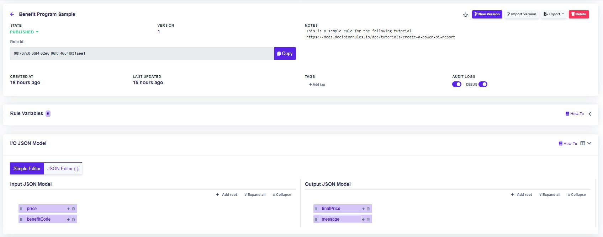
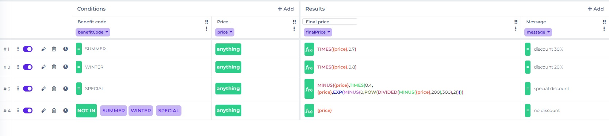
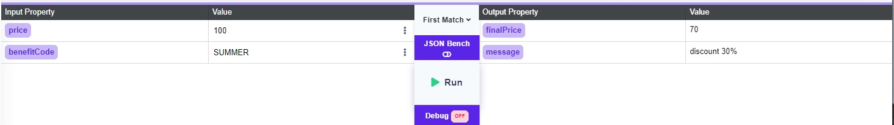
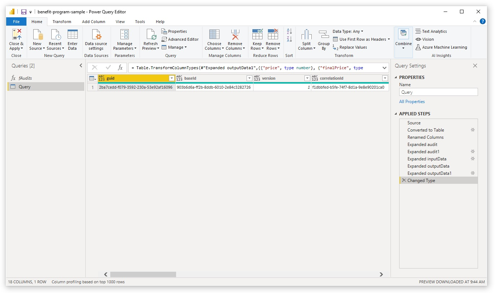
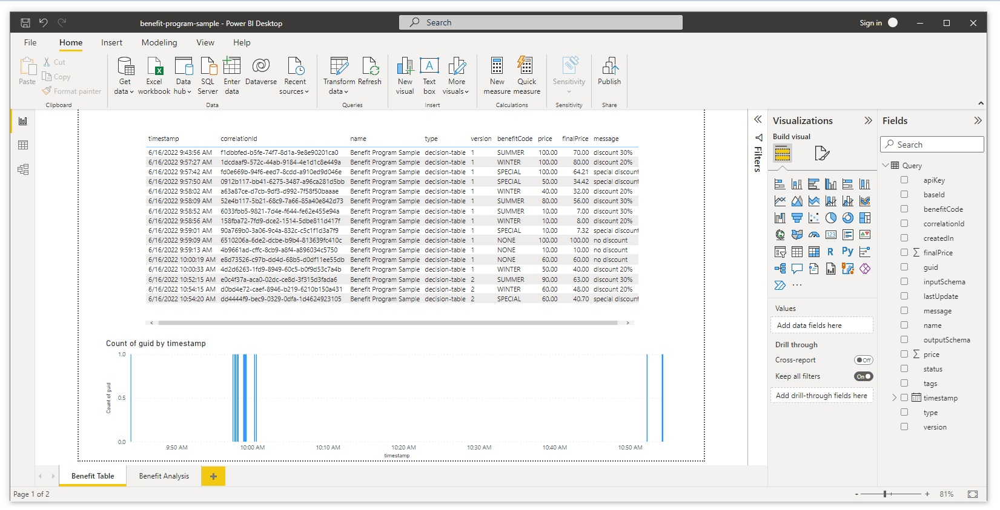
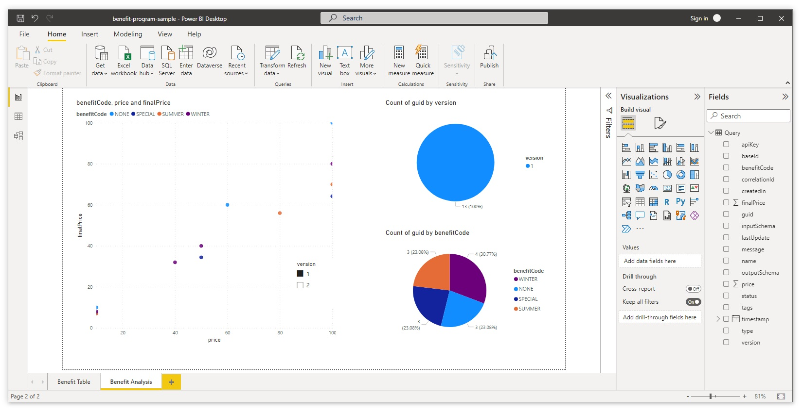

# Create a Power BI Report

DecisionRules provides the Audit Log functionality which allows to store detailed information from each run of the rule solver. The audit logs can be then accessed through our [Business Intelligence API](../api/bi-api.md), in particular its `/audit` endpoint, and used as a base for further analysis performed with the help of an arbitrary BI tool. In this tutorial, we shall start with a simple rule (a single Decision Table), call it with mock data and build a report in Power BI Desktop, all step by step.

## From a business rule to a Power BI report

Let's start! You can follow the steps below or skip to the end of the page where we provide a resume with all the necessary files, including the sample Power BI report.

### 1. Log in to DecisionRules

Go to the [login page](https://app.decisionrules.io/auth/login) and pass in your credentials. If you do not have an account yet, you can quickly create it [here](https://app.decisionrules.io/auth/register). After you log in, you should see the Dashboard.

### 2. Create a Decision Table

Click the Decision Tables item in the menu, which brings you to the list of your Decision Tables. For the purpose of this tutorial, we shall create a single short Decision Table. You can create it by hand or just import the table that we prepared.

Our rule will be called Benefit Program Sample. Its purpose is to implement a trivial benefit program: given some <mark style="color:purple;background-color:purple;">**price**</mark> and <mark style="color:purple;background-color:purple;">**benefitCode**</mark> on the input, it will give us some <mark style="color:purple;background-color:purple;">**finalPrice**</mark> and <mark style="color:purple;background-color:purple;">**message**</mark> on the output.

#### Steps for creating the table

In the Decision Tables section, click the **+Decision Table** button and select **Empty Decision Table**. You will be taken to the Decision Table Designer. First, go the the **Rule settings** tab, rename your Decision Table to 'Benefit Program Sample' and scroll down to the **I/O JSON MODEL** section. Here you need to set up the input and output model. Please, do it in accordance with the following image, listing price & benefitCode as inputs and finalPrice & message as outputs.



Now we are ready to edit the table itself. Click the **Decision Table Designer** tab. This is the place to specify our conditions and results. Click the <mark style="color:purple;background-color:purple;">**Input attribute**</mark> button in the first column in the Conditions section and select <mark style="color:purple;background-color:purple;">**benefitCode**</mark>. Then click the + Add button to add one more condition column, and select <mark style="color:purple;background-color:purple;">**price**</mark> as the input attribute. Similarly, in the Results section, we would like to have two columns, one with <mark style="color:purple;background-color:purple;">**finalPrice**</mark> and the other with <mark style="color:purple;background-color:purple;">**message**</mark> as the output attribute. Now we are done defining our condition and result attributes.



All we have to do now is to add the suitable rows defining our conditions and results. If you feel like it, try to recreate the rows from the image above. They are all quite simple, except the final price in row 3, which is supposed to read

```
MINUS({price},TIMES(0.4,{price},EXP(MINUS(0,POW(DIVIDED(MINUS({price},200),300),2)))))
```

Should you have problems with recreating the table, please refer to [Table Designer](../decision-tables/decision-table-designer.md) or [Create a Simple Decision Table](create-simple-decison-table.md) for more details on how to work with the designer.

#### Steps for importing the table

In the Decision Tables section, click the **Import** button, drop the below provided JSON file to the drop-in area and hit **Save**. This should load the same Decision Table for you.



### 3. Test the rule

Now we should check that the rule does what we need. This will be a simple task. First visit the **Rule Settings** tab again and (if not already published) change the state of the rule from **Pending** to **Published**. This means we can request the rule solver to solve this particular rule. Next go back to the **Decision Table Designer** tab and click the **Test Bench** button.

Now we can enter some input data and see what the rule does with them. Let us enter 100 for <mark style="color:purple;background-color:purple;">**price**</mark> and SUMMER for <mark style="color:purple;background-color:purple;">**benefitCode**</mark>. Upon hitting Run, we should get <mark style="color:purple;background-color:purple;">**finalPrice**</mark> equal to 70 and <mark style="color:purple;background-color:purple;">**message**</mark> reading 'discount 30%'. In other words, the rule is telling us that with the SUMMER benefit code, we get 30% discount. This is the desired behavior.



### 4. Turn on Audit Logging

Now that we have created and tested our Decision Table, it is time to start logging! In the Rule Settings, find the **Audit Logs** slider and turn it on. The audit logging is now activated! From now on, every rule solve will generate an audit log and save it to the database. You do not need to turn on **Debug Data** now, that is just some supplementary data about your rule solve. For the sake of this tutorial, you may set the **Audit Lifespan** for 1 day, since you do not need the audits to live for any longer periods.

### 5. Run some rule requests

You can now simply use Test Bench to call the rule again, as in Step 3. If you choose this option, enter various input values and **Run** the rule couple of times so that there is some data to query later. Try all the listed benefit codes. Alternatively, you may of course make some calls to the rule solver via the [Rule Solver API](../api/rule-solver-api.md).

### 6. Generate your Business Intelligence API Key

We will use the [Business Intelligence API](../api/bi-api.md) to fetch the audit logs in Power BI. However, for it to work, you need your Business Intelligence API Key. You can quickly generate it in the **API Keys** section of the app. Just find the Business Intelligence API Keys section and click **+Add Business Intelligence API Key**. Good. You will find this key here when you need it.

### 7. Prepare your query

In this step, we shall assume you have already downloaded and installed the Power BI Desktop. If not, please do it before you continue with the tutorial.

We have all we need to prepare our first DecisionRules query in Power BI, great! From here, there are two parallel ways to continue. You can either start building the report from scratch or just download our sample report and modify it to work with your rule. Both procedures are described below.

#### Create your report from scratch

If you are starting from scratch, please follow these [instructions](https://docs.decisionrules.io/doc/business-intelligence/connect-power-bi-to-bi-api). In the place where you need to place the API key, place the key that you have generated in Step 6. If you have more rules with audit logging turned on, it is also a good idea to use the `rules` query parameter to get only logs for our Benefit Program Sample rule. That is, your fAudits function will look something like this.

```
(Page as number) =>
let
    Source = Json.Document(Web.Contents("https://bi.decisionrules.io/audit?bi_key=your-api-key-here&rules=your-rule-id-here&limit=100&page="&Number.ToText(Page)))[audits]
in
    Source
```


Do not forget to copy paste your own **Business Intelligence API Key** and your own **rule Id**. The rule Id of your decision table can be found in the Rule Settings tab.


If you have successfully completed the instructions, you should have a working query now, that is, you should see some data loaded in your Power Query Editor.


If the query does not return anything, check again these things: Do you have audit logging active on the rule? Did you make any calls to the rule solver (through the Test Bench or via the Rule Solver API) **after** activating it? Is your fAudits function defined correctly? Did you enter a valid Business Intelligence API Key as a query parameter in the URL?



If you are getting any errors in the Power Query editor, please try to browse the list of steps on the right-hand side and see where they originate. Then adjust or delete the problematic steps and **** try to recreate them.


If everything worked well, you now have a working query which is able to obtain the audit logs from the database, and you can indeed see some records loaded.

You can now edit the query in different ways depending on the kind of data you would like to display and the way you wish to display them. For the start, you probably want to expand the columns with your input and output data, which are now hidden inside the respective columns. In the Power Query Editor, go to your query and find the **inputData** column. Then click the diverging arrows in the corner of its header cell. Uncheck the _Use original column name as prefix_ option (we do not need that) and click **OK**. You now see your input data! Do the same for the **outputData** column. When prompted, choose the _Expand to new rows_ option and click the diverging arrows again.

Another common step is changing the value type of columns. Find the **price** column, right-click its header cell, go to Change Type and select Decimal Number. Do the same with **finalPrice**. Last but not least, go to the **timestamp** column and change its type to Date/Time.



When you are done, click **Close & Apply**. Congratulations, your query is ready now! If you need to return to the Power Query Editor at some point, you may just click the **Transform data** button.

#### Download and modify the sample report

Download the below given file and open it in Power BI Desktop.



You will need to do a couple of adjustments so that the query works. First, click the **Transform data** button in the **Home tab**. This will bring you to the Power Query Editor. In there, right-click the fAudits function in the Queries list on the left-hand side and choose Advanced Editor. The function defines the URL pointing to our BI API /audit endpoint. In the URL, pass your own Business Intelligence API Key from Step 6 and the rule id of your Benefit Program Sample rule. The rule id can be found in Rule Settings.

If your input and output model is not exactly the same as the one we have defined in Step 2, you may encounter an error. However, it can be easily removed by going to the Power Query Editor, right-clicking the Query, going to the Advanced Editor and there fixing the column names so that they match your input/output model. Then click **Close & Apply** and you are good to go.

### 8. Play with your visuals

If you have taken the hard way and tried to build your report from scratch, you now have the opportunity to create your own visuals.

#### Creating your visuals

We will not go into detail about creating the visuals as one can read about this topic elsewhere. Let us add only a few very basic notes. In the right hand side of Power BI Desktop, there is a **Fields** area listing the queries that can be used for building custom visuals, and next to it are **Visualizations** where you can introduce and manage your visuals. So, all you need to do is choose one of the available visuals and then provide it with the fields that you would like to visualize by selecting them from your query.

Lucky visualizing!

#### Sample report

If you have downloaded our sample report and managed to load your audit data to it, you should already see the data visualized in two tabs. In the **Benefit Table** tab, there is a table listing the individual audits including the input and output data, and a graph showing the requests in time. In the **Benefit Analysis** tab, you can find two pie charts (one looking at the versions of the rule, for now showing only version 1, because you have not created any other versions yet; another looking at the benefit codes) and one scatterplot showing the price and final price of the distinct rule solves. We have also included one slicer, also for versions.





You may now try to play with the visuals, adjust them as you wish or introduce some new.

### 9. Further suggestions

If you have reached this point, congratulations! You have successfully completed the tutorial. If you wish to learn even more, there is a couple of suggestions on what you might do next.

* Try to create a new version. Go back to DecisionRules and create a new version of the Benefit Program Sample rule (just go to its Rule Settings and click the **New Version** button). Then change the rule in some way, save it, publish it (in Rule Setting again) and use the Test Bench to call the rule several times. Return to Power BI and check whether you can see the audit logs from the new version (hit **Refresh** to see the new data).
* Try to apply some filters. Check out our [Business Intelligence API](../api/bi-api.md) documentation and try to apply filters to your query by including some query parameters to the URL in the fAudits function.
* Play with your queries. Duplicate or reference your Query in the Power query editor and try to introduce new columns, group the query by some identifier, and more.
* Play with your visuals.

### Wrapping up

You have gone through all the steps towards creating your DecisionRules Power BI report. Big thumbs up! Now you have all the information you need for your successful DecisionRules reporting with Power BI. Below you find the resources used in this tutorial.


Benefit Program Sample rule JSON



Sample Power BI report


Thank you for reading!
