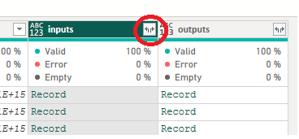

# Create a Power BI Report

DecisionRules provides the Audit Log functionality which allows to store detailed information from each run of the rule solver. The audit logs can be then accessed through our [Business Intelligence API](../api/bi-api/), in particular its `/audit` endpoint, and used as a base for further analysis performed with the help of an arbitrary BI tool. In this tutorial, we shall start with a simple rule (a single Decision Table), call it with mock data and build a report in Power BI Desktop, all step by step.


If your plan is to use this report in Power BI Service please use our Connect Power BI to Bussiness Intelligence API article [here](../business-intelligence/connect-power-bi-to-business-intelligence-api.md). This connector is not yet certified by Microsoft and thus can't be used in Power BI Service.


## From a business rule to a Power BI report

Let's start! You can follow the steps below or skip to the end of the page where we provide a resume with all the necessary files, including the sample Power BI report.

### 1. Log in to DecisionRules

Go to the [login page](https://app.decisionrules.io/auth/login) and pass in your credentials. If you do not have an account yet, you can quickly create it [here](https://app.decisionrules.io/auth/register). After you log in, you should see the Dashboard.

### 2. Create a Decision Table

In your home folder click the option **+Create Rule,** in the following menu choose **Decision table -> Sample ,** enter a name for the table and click **Create Rule**

<figure><figcaption>
Create rule menu
</figcaption></figure>


If you want to create your own table, you can absolutely do so. However you will need to perform additional modification in the provided PowerBI file to import your data ( these are described at the end of this page )


### 3. Test the rule

Now we should check that the rule does what we need. This will be a simple task. First open the newly created rule and visit the **Rule Settings** tab and (if not already published) change the state of the rule from **Pending** to **Published**. This means we can request the rule solver to solve this particular rule. Next click the **Test Bench** button at the bottom of the page.

Now we can enter some input data and see what the rule does with them. Let us enter "basic" for <mark style="color:purple;background-color:purple;">**productType**</mark>, "month" for <mark style="color:purple;background-color:purple;">**period**</mark> and "SUMMER SALE" for <mark style="color:purple;background-color:purple;">**promoCode**</mark>. Upon hitting Run, we should get <mark style="color:purple;background-color:purple;">**finalPrice**</mark> equal to 5.6, <mark style="color:purple;background-color:purple;">**crudePrice**</mark> 8 and <mark style="color:purple;background-color:purple;">**message**</mark> reading '30% discount'. In other words, the rule is telling us that with the SUMMER SALE benefit code, we get 30% discount. This is the desired behavior.

<figure><figcaption>
Using the test bench
</figcaption></figure>

### 4. Turn on Audit Logging

Now that we have created and tested our Decision Table, it is time to start logging! In the Rule Settings, find the **Audit Logs** slider and turn it on. The audit logging is now activated! From now on, every rule solve will generate an audit log and save it to the database. You do not need to turn on **Debug Data** now, that is just some supplementary data about your rule solve. For the sake of this tutorial, you may set the **Audit Lifespan** for 1 day, since you do not need the audits to live for any longer periods.

### 5. Run some rule requests

You can now simply use Test Bench to call the rule again, as in Step 3. If you choose this option, enter various input values and **Run** the rule couple of times so that there is some data to query later. Try all the listed benefit codes. Alternatively, you may of course make some calls to the rule solver via the [Rule Solver API](../api/rule-solver-api.md).

### 6. Generate your Business Intelligence API Key

We will use the [Business Intelligence API](../api/bi-api/) to fetch the audit logs in Power BI. However, for it to work, you need your Business Intelligence API Key. You can quickly generate it in the **API Keys** section of the app. Just find the Business Intelligence API Keys section and click **+Add Business Intelligence API Key**. Good. You will find this key here when you need it.

### 7. Connect to Power BI using the DecisionRules Connector

In this step, we shall assume you have already downloaded and installed the Power BI Desktop. If not, please do it before you continue with the tutorial.

We have all we need to create a connection from Power BI to DecisionRules, great!&#x20;

#### Download DecisionRules Connector

Before you open Power BI and start importing your data you need to first download and prepare our connector. Don't worry is easier than it sounds. Start by download the file bellow.


DecisionRules Connector


After you have downloaded the file you have to place it in a specific location for Power BI to find the file and use it to create a custom connector. In windows place the file in the following location:

`C:\Users\[userName]\Documents\Power BI Desktop\Custom Connectors\.`

In some cases the following loaction is also acceptable as it references the same path:

<figure><figcaption>
Folder path
</figcaption></figure>


Please note that the folders might not exist. In that case create the required folders spelled exactly as above. If your Power BI Desktop application is open during this process you will have to restart it so that it will recognize the file.


After inserting the file in the desired location Power BI will recognize the connector and list it as an available data source.&#x20;

Now is the time to dive into Power BI! Open your Power BI Desktop app and go to options and settings > Options > Security. There you will find section Data Extensions. Switch from the recomended option to not recomended. You dont have to wory about any security problems. If you choose your custom connectors and data extension wisely and from trusted sources such as this documentation you won't encounter any problems.&#x20;

<figure><figcaption>
Options and Settings > Options > Security > Data Extensions
</figcaption></figure>

Hit OK and you will find yourself on the deafut page of a Power BI report. Let's import your data so you can later create some visualizations here.

From here, there are two parallel ways to continue. You can either start building the report from scratch or just download our sample report and modify it to work with your rule. Both procedures are described below.

#### Create a report from scratch

On the top bar click the option to get data and choose "More...".

<figure><figcaption>
Get Data 
</figcaption></figure>

You will be presented with a list of all avalible data sources that can be accessed from Power BI. Among them you will find DecisionRules in the section Other.

<figure><figcaption>
DecisionRules in the list of avalible data sources
</figcaption></figure>

Connect to the DecisionRules data source. A window will appear warning about the risks of using a connector that is still under development. Please note that altough it is very unlikely in case of any changes that might give you trouble you will find solution in our documentation. Since you have the connector downloaded if you choose to use the same verison of the connector in the future any release of a new version will not affect you unless you will decide to switch to the newer version. In that case you will be able to find guidance in our documentation. Click OK and move on to the next step

Next up the connector will ask you to provide two values.&#x20;

<figure><figcaption>
Choose your hosting region
</figcaption></figure>

The first one is required and you will have to choose form a dropdown list. Choose the value based on the hosting region of your DecisionRules engine. In case you are hosting your DecisonRules engine on your own server choose the sefl hosting option. Next value is optional and will only be accepted if you choose the self host option. Here you have to specify the url of your Buisiness Intelligence API. Use only the base url. For further information about the Buisiness Intelligence API ook [here](../api/bi-api/). After you filled in the values acording to your situation click OK.

You will be then redirected to a window asking for your Buisiness Intelligence API Key. We wil now make use of the key we generated in step 6. Go to your DecisionRules client and copy\&pate the key to the Business Intellingence API Key field.

<figure><figcaption>
Authentication window
</figcaption></figure>

Hit Connect and you will find yourself in the Navigatior. Here you can choose from two funtions that import data to Power BI. First is the Input/Output Data function wich as you surely guessed imports Input and Output Data into Power BI. Second is Technical wich import technical data about your rule trafic. Choose the one that suits your needs the best. For our tutorial I will choose both the Technical function and Input/Output Data function.&#x20;

<figure><figcaption>
Navigator window
</figcaption></figure>

Now there are two options  bellow. 'Load' and 'Transfom Data'. The 'Load option loads data directly to the Power BI Data Model as they are returned by the data source. We do not recommend you to proceed with this option if you are not very familiar with your data. However if you know what to excpect from your data this option can be used with the techncal data as they are retrieved from the source in an acceptable format. For Input/Output Data is it always recommended to go with the 'Transform Data' option since the input and output models are enclosed within a record that needs to be further expanded and this option takes you to Power Query where you can further work on transforming your data.&#x20;

In Power Query in the Queries Pane on the left you will be able to see the data from the functions you choose in the previous step.

<figure><figcaption>
Invoked Queries
</figcaption></figure>

In this step you can get familiar with your data and transfomr them into the desired format, such as chenge types, drop unnessessary column, create additional columns etc... We will not go into detail regarding these transfomration. If you would like to know more you can check the Oficial Microsoft Power BI Documentation [here.](https://learn.microsoft.com/en-us/power-bi/) The only transfomration we will do in this tutroial is expanding the input and output data.

Lets start with the input data. Go to the Input/Output Data query and click ion the expand button that you can find in the headline of the column.&#x20;

<figure><figcaption>
Expand columns
</figcaption></figure>

Now choose wich input fileds you want to expand. And make sure the 'Use original column name as prefix' is checked. If not you might have a hard time telling the inputs and outputs apart.&#x20;

<figure><figcaption>
Choose columns to expand
</figcaption></figure>

You will find the data in a format simmilar to the following.

<figure><figcaption>
Expanded inputs
</figcaption></figure>

Now lets do the same thing to outputs. Depending on the model you have defined you might need to repeat the expand column multiple time. Now in our case we will have to expand the outputs column twice. Click the expand button and proceed like we did in the previous step.&#x20;

<figure><figcaption>
Expanded Outputs
</figcaption></figure>

As you can see the outputs.prices contain another record type values. To expand them further proceed as above.

<figure><figcaption>
Final version of expanded oututs
</figcaption></figure>

Note that you can see wich output object belongs where in the column headline. Here you can see that the finalPrice is a part of prices object in the ouptut model. Now you have the all the columns you need to preform your analysis in power BI. When you are done with the transformations hit the 'Close & Apply' button in top left corner. This will save the data and load it into the Power BI Data Model.

#### Download and modify the sample report

Download the below given file and open it in Power BI Desktop. The project contains simple graphs and tables whose main purpose is to show whether or not the data is actually loaded into PowerBI.


You will need to set up your connector first before opening this file.




If your input and output model is not exactly the same as the one we have defined in Step 2, you may encounter an error. However, it can be easily removed by going to the Power Query Editor, right-clicking the particular query, going to the Advanced Editor and there fixing the column names so that they match your input/output model. Then click **Close & Apply** and you are good to go.

### 8. Play with your visuals

If you have taken the hard way and tried to build your report from scratch, you now have the opportunity to create your own visuals.

#### Creating your visuals

We will not go into detail about creating the visuals as one can read about this topic elsewhere. Let us add only a few very basic notes. In the right hand side of Power BI Desktop, there is a **Fields** area listing the queries that can be used for building custom visuals, and next to it are **Visualizations** where you can introduce and manage your visuals. So, all you need to do is choose one of the available visuals and then provide it with the fields that you would like to visualize by selecting them from your query.

Lucky visualizing!

### 9. Further suggestions

If you have reached this point, congratulations! You have successfully completed the tutorial. If you wish to learn even more, there is a couple of suggestions on what you might do next.

* If you wish to create connections between your queries we sugest you to create an Index column as the firts thing when starting with transformations. That way you will not loose the logic behind connecting inputs to outputs and technical data.
* Allways check how Power BI loaded the queries into your model. Power BI makes connections between queries by default and those connections might be defined in a way that can mess up your visuals.
* Play with your queries. Duplicate or reference your query in the Power query editor and try to introduce new columns, group the query by some identifier, and more.
* Play with your visuals.

### Wrapping up

You have gone through all the steps towards creating your DecisionRules Power BI report. Big thumbs up! Now you have all the information you need for your successful DecisionRules reporting with Power BI.

Thank you for reading!
