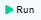

# Create a Simple Decision Table

Decision Tables are without a question one of the most important tools for creating business rules. Within DecisionRules, they are fairly easy to create and manage. We believe that, with the help of this tutorial, you can master the basics quickly.

## How to create a simple decision table

Let's advance one step at a time.

### 1. Log in

Becoming a superhero is a fairly straightforward process. After entering our [login page](https://app.decisionrules.io/auth/login), you will be able to pass your credentials and log in.

<figure><figcaption></figcaption></figure>

There are multiple options for user login. If you do not have an account yet, you can [create one](https://app.decisionrules.io/auth/register?type=true-registration). After logging in to the application, the[ Dashboard](../) will be displayed.

<figure><figcaption></figcaption></figure>

### 2. Go to Create rule

To display the rule creation pop-up click the   button on the sidebar.

<figure><figcaption></figcaption></figure>

### 3. Create a new Decision Table

You will be prompted to provide a name and choose between **SAMPLE RULE** or **EMPTY RULE.** For now, name the rule as you wish and choose the EMPTY RULE. The new rule will be created and its detail will be displayed. We will continue in the Rule Settings tab.


More information can be found in our documentation on [Decision Tables](broken-reference).


<figure><figcaption></figcaption></figure>

### 4. Make basic settings

Once we are in the Rule Settings, let's do some settings. Since we do not want this decision table to be available yet, we will change its status to **Pending**. To do this, click on the current status **Published** and then select **Pending**.

To apply these changes, we have to click the button at the bottom of the page.

<figure><figcaption></figcaption></figure>

### 5. Create the input and output model

We will now create the input and output model which is used to set conditions and results. There are 2 ways to create these models:

* Simple editor is intended for inexperienced users who do not know the syntax of JSON files.
* JSON editor is intended for an experienced user.

#### Using the simple editor

Let's start with the input model. First we delete all default attributes by clicking the trash can icon. Then we add our own attributes: <mark style="color:purple;background-color:purple;">**`period`**</mark>, <mark style="color:purple;background-color:purple;">**`productType`**</mark>and <mark style="color:purple;background-color:purple;">**promoCode**</mark>. We create a root for each of them by clicking the **+Add root** button.


More information on the simple editor is provided [here](../decision-tables/input-and-output/simple-editor.md).



After creating an input or output model, we must always confirm the changes with the button.


Now we can continue with the output model. It will be set similarly. As root attributes, we add <mark style="color:green;background-color:green;">**prices**</mark>and <mark style="color:green;background-color:green;">**message**</mark>. Here, we would like to add a child attributes to the [<mark style="color:green;background-color:green;">**prices**</mark>](#user-content-fn-1)[^1]. We do that by clicking the + icon within the prices field. We rename the New Attribute to <mark style="color:green;background-color:green;">**finalPrice**</mark> and then add one more, <mark style="color:green;background-color:green;">**crudePrice**</mark>.

<figure><figcaption></figcaption></figure>

#### Using the JSON editor

In the JSON editor, we can provide the input and output model in JSON format. In our case, the input model will read

```javascript
{
  "period": {},
  "productType": {},
  "promoCode": {}
}
```

while the output model shall read

```json
{
  "prices": {
    "finalPrice": {},
    "crudePrice": {}
  },
  "message": {}
}
```

For now, you may just enter these values and you are done!


More information on the JSON editor can be found [here](../decision-tables/input-and-output/json-editor.md).


<figure><figcaption></figcaption></figure>

### 6. Set the conditions and results

To create conditions and results, you must go to the **Table Designer** tab. Now let's move on and bind our input and output models to our condition and result columns.

<figure><figcaption></figcaption></figure>

We already have one condition column and one result column here. We start with the conditions. Click the <mark style="color:orange;background-color:orange;">**input**</mark>** ** dropdown and select <mark style="color:purple;background-color:purple;">**productType**</mark>. Then click the **+** button at the top of the conditions section twice to create two more columns. Bound these to our <mark style="color:purple;background-color:purple;">**period**</mark> and <mark style="color:purple;background-color:purple;">**promoCode**</mark> input attributes. These are all the conditions we will use.

Next we add the result columns. One is already there, so click the <mark style="color:orange;background-color:orange;">**output**</mark> dropdown and select <mark style="color:green;background-color:green;">**prices.crudePrice**</mark>. Then create two more columns by clicking the **+** button at the top and bind them to <mark style="color:green;background-color:green;">**prices.finalPrice**</mark> and <mark style="color:green;background-color:green;">**message**</mark>. These are all the results we need.


More information about creating conditions and results can be found in the [Table Designer Section](../decision-tables/decision-table-designer.md) and [Binding to Model Section](../decision-tables/binding-to-model.md).


After adding conditions and results, we can also set their names. To do this, click the name, currently reading **New Condition**, and rewrite it.


Do not forget to click thebutton.


### 7. Edit rows

Currently, we have a single row in the Decision Table.


Each row of the table corresponds to one set of conditions and results. When the [Rule Solver](../api/rule-solver-api.md) is called, it goes through the individual rows and evaluates their condition values against the corresponding request input data. If some values of the conditions in a row match, [Rule Solver](../api/rule-solver-api.md) takes the values of the individual results on that row and places them in the output.


Let's set the conditions in the first row.

#### Product Type

Click the **anything** label in the <mark style="color:purple;background-color:purple;">**productType**</mark> column. You can choose a type of condition from the Select type modal. We would like to activate the results of this row when the value of <mark style="color:purple;background-color:purple;">**productType**</mark> is `basic`. We can do that simply by selecting the Equals operator and entering the string `basic`.

#### Period

We will use the Equals operator for <mark style="color:purple;background-color:purple;">**period**</mark> as well. This row will activate when the <mark style="color:purple;background-color:purple;">**period**</mark> will be equal to `month`.

#### Promo Code

Here we want to check whether the customer's promo code is correct. We could again enter the desired value with an Equal operator, but we can do better. Let's go to Rule settings and open the Rule Variables section. Here we shall add two Rule Variables. The first one will have name `PromoCode` and value `SUMMER SALE` while the other will have name `PromoDiscount` and value  `30`. Rule variables make our rules easily manageable. If we later want to change the promo code, we do it only on a single place: in the Rule Settings.

Click Save and go back to the Decision Table Designer. Now you can add the condition for <mark style="color:purple;background-color:purple;">**promoCode**</mark>. Select again the Equals operator and eneter `{PromoCode}`in the field. This expression refers to the `PromoCode` Rule variable.


An overview of all operators is [here](../decision-tables/operators/).\
An overview of all possible values is [here](../decision-tables/data-types.md).


Now we are going to continue with setting results.

#### Crude Price

In the <mark style="color:green;background-color:green;">**prices.crudePrice**</mark> column, leave the simple value denoted by = and enter `8`. This is the crude price for our service in case of basic subscription for a month.

#### Final price

Because we are in the row where the promo code is matched, we will give a discount on the crude price. Click the = sign and select **Function**. Then enter the following expression:

```
TIMES({prices.crudePrice},DIVIDED(MINUS(100,{PromoDiscount}),100))
```

It means that we calculate the final price by taking the crude price and subtracting 30% discount defined by the `PromoDiscount` variable. Note that we are referring to the <mark style="color:green;background-color:green;">**prices.crudePrice**</mark> column by writing `{prices.crudePrice}`.

#### Message

Finally, let's include some message about what happened on this row. In the <mark style="color:green;background-color:green;">**message**</mark> column, again select the **Function** type of the result and enter the following expression:

```
CONCAT("{PromoDiscount}","% discount")
```

This function will take the `PromoDiscount` variable and concatenate it with the given string to generate the desired message.


Do not forget to click thebutton.


You can now click the three dots at the beginning of the row and select **Insert Below**. This will add another empty row below. Its conditions and results may be set analogically. More rows can be added in a similar fashion. In this way, you can create a rule similar to the following sample rule.



You can import this rule to your space by going to **Decision Tables** and clicking the **Import** button.

### 8. Test the Decision Table

Now we can test our rule in Test Bench. Before testing the rule, we must go to Rule Settings and change the status of the decision table to **Published**.

If we want to test a certain row, we can click the .png>)icon at its beginning. After clicking the icon, the values from the row will be pre-filled in **Test Bench**, which will show up at the bottom of the page. We can freely modify these values. For instance, if you click the first row of your Decision Table, you will have to enter the correct <mark style="color:purple;background-color:purple;">**promoCode**</mark>, which should be `SUMMER SALE`.

Then we can click the button and the result will be displayed in right hand side of the Test Bench. Note that you can switch between the **Simple Bench** and the **JSON Bench**.

For example, if we switch to the JSON Bench, we may input the following data.

```javascript
{
  "productType": "basic",
  "period": "month",
  "promoCode": "SUMMER SALE"
}
```

Upon hitting Run, we will get the following response.

```javascript
[
  {
    "prices": {
      "finalPrice": 5.6,
      "crudePrice": 8
    },
    "message": "30% discount"
  }
]
```


More information about Test Bench can be found [here](broken-reference).


If you have arrived here, you have successfully completed the tutorial. Congratulations!

[^1]: 
