# Create Simple Rule Flow


In this tutorial, you need to have knowledge of [Decision Tables](create-simple-decison-table.md) or [Scripting Rules](code-editor.md). 


## 1. Create Decision Tables

We have already learned how to create rules in previous tutorials, so let's skip it now and import these decision tables:



* **Clients -** a rule that determines the maximum loan according to the client's age and salary



* **Loan Type -** a rule that determines the maximum loan tax according to how much and for what the client wants to borrow



* **Bank Solver -** a rule that calculates how much the client pays in total


How to import [Decision Tables](../decision-tables/import-and-export-rule/import-decision-table.md)


## 2. Go to Rule Flow

To go to the Rule Flow page on the left in the sidebar, click on the **Rule Flow** link. The Rule Flows of the user will be shown if any exists.

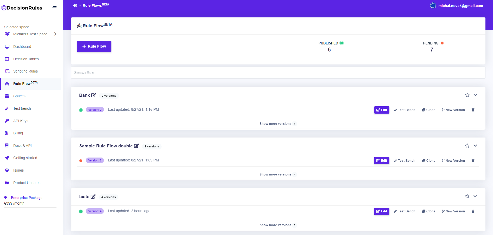

## 3. Create a new Rule Flow

To create a new rule, click the button 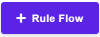 . After clicking, you can choose between **SAMPLE RULE FLOW** or **EMPTY RULE FLOW** to create**.** Choosing either one the new rule will be created and its detail will be displayed automatically.


In our case, we recommend you select the empty rule.


## 4. Set Rule Flow settings

When we are at the detail of the Rule flow, we first set some information in **Rule Flow Settings** tab. We will change the name of our Rule Flow. To do this, click on his name. Then a field will appear where we can rename the name and click on the  icon. To cancel the changes, click on the  icon.

Since we do not want this decision table to be available yet, we will change its status to **"Pending"**. To do this, click on the current status **"Published"** and then select **"Pending"**.

For applying these changes, we have to click on the button at the bottom of the page.

## 5. Create an Input and Output model

We will now create an input and output model, which will then be used to set conditions and results. You must be in **Rule Flow Settings.** There are 2 ways to create these models: 

* **Simple editor:** It is intended for inexperienced users who do not know the syntax of JSON files.
* **JSON editor:** It is intended for an experienced user, with JSON knowledge.

### Create with a simple editor


After creating an input or output model, we must always confirm the changes with the button


#### **Input model**

First, we delete all created objects by clicking on the icon \(in case you chose Sample Rule Flow\). Then we will add our specified requirements \(**age, salary, loan, loanType**\). In our case, we create a root for each request by clicking on the button.


If our model were more complex, we would add descendants. More information is described [here](../decision-tables/input-and-output/simple-editor.md). 


#### **Input model Example:**

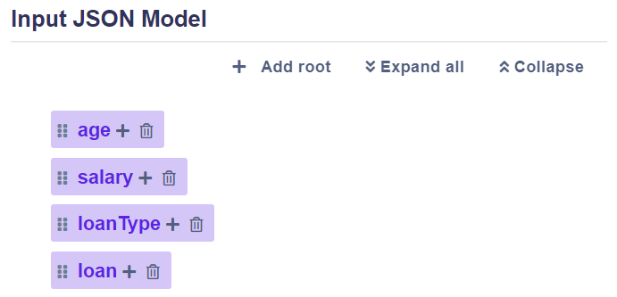

#### **Output model**

We set the output model similarly, where we set as root **loan**, **tax**, **totalPay** and **message**.

**Output model Example:**

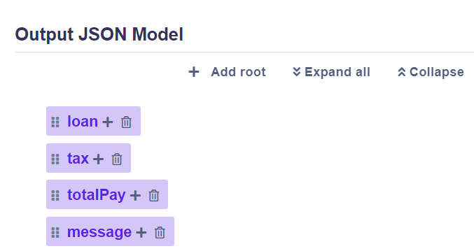

### Create using JSON editor

#### **Input model** 

First**,** we will create one object into which we will put other objects with our requirements. We will create one empty object for each request.


Our model is simple, these objects do not contain any others \(embedded attributes\). For more complex models, more information is [here](../decision-tables/input-and-output/json-editor.md).


#### **Input model Example:**

```javascript
{
  "age": {},
  "salary": {},
  "loanType": {},
  "loan": {}
}
```

#### **Output model**

We set the output model similarly, where we set as root **loan**, **tax**, **totalPay** and **message**.

**Output model Example:**

```javascript
{
  "loan": {},
  "tax": {},
  "totalPay": {},
  "message": {}
}
```

## 6. Creating Rule Flow schema

1. To create Rule Flow schema go to the Rule Flow Designer tab. At the start the canvas is empty. Add there input, output, and three empty rules with buttons in the top-right corner: 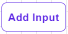,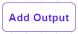,.
2. Click on the Empty rule to display the sidebar. By buttonchoose a rule, that will be in place of the empty rule. 
3. Connect rules together and to input box and output box. In this case, the correct connect is as follows:  

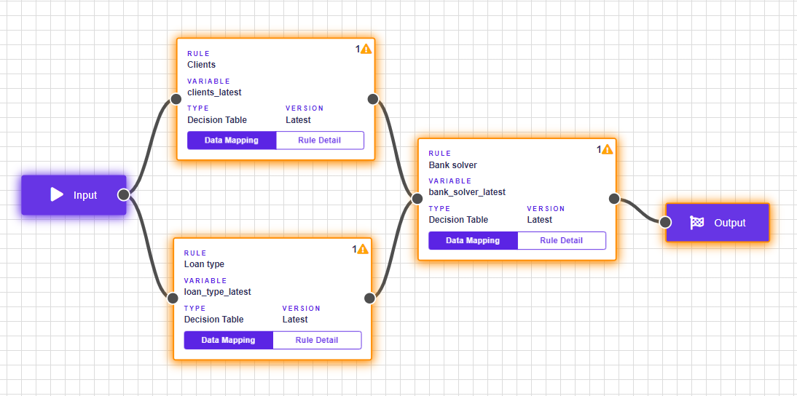


The rule should look as in the picture above.


## 7. Map data

To know, which data has to go where we have to map the data. 


If the rule has no inputs mapped. It borders in orange and displays a warning icon


The example Rule Flow - **Clients** and **Loan type** works with user input data and subsequently, **Bank solver** works with input of user data and with outputs from previous rules makes the decision and sends final outputs to the output box.

### 7.1 Data mapping Client sorter

Open data mapping by clicking on  .


**Global variable** means where the rule takes data from and **output** means what data. Because this rule is connected immediately after the input box, only **user input data** can enter it.

Correct mapping of **Clients** from example:

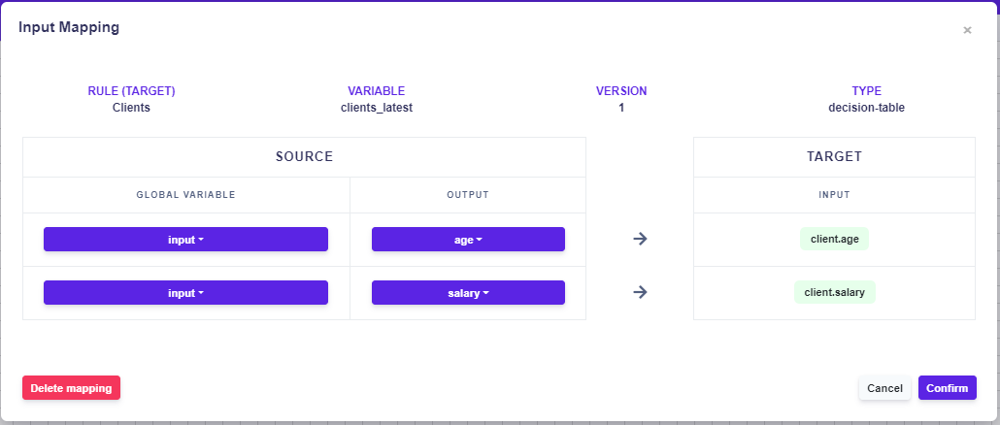

### 7.2 Data mapping Loan type

The loan type is also directly connected after the input box, so only **input user data** will also enter it.

Correct mapping of Loan type from example:

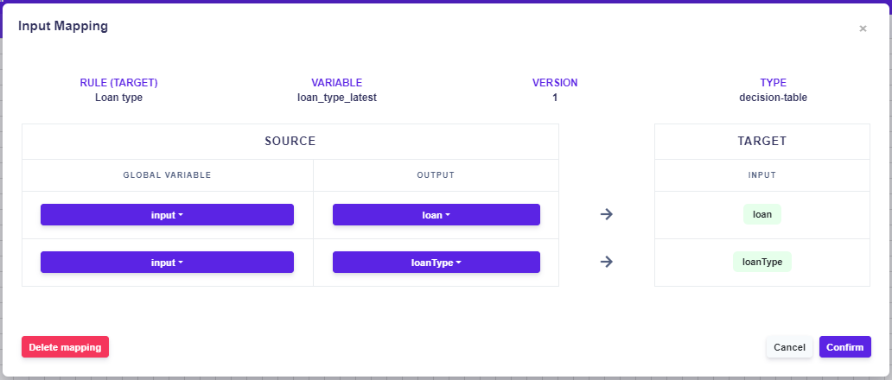

### 7.3 Data mapping Bank solver

The **bank solver** is the final rule, that takes data from both the **previous rules** and the **input box.**

Correct mapping of Bank solver from example:

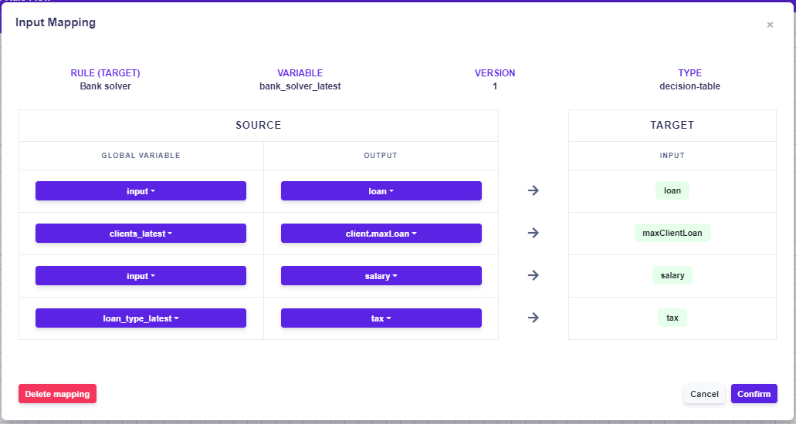

### 7.4 Data mapping Output box

The final output can be data from any rule, so it is necessary to map the Output as well. In this example we want the following data to be in the output:

* **Loan** - the amount the customer wants to borrow
* **Tax** - tax of the loan
* **TotalPay** - the amount the customer pays
* **Message** - that is displayed only if the client does not reach the loan

Correct mapping for output:

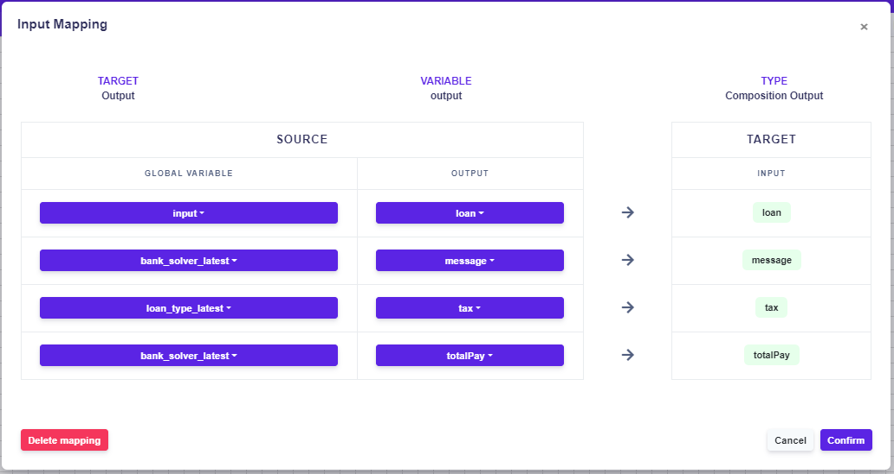

## 8. Test of created Rule Flow

Now we can test our Rule Flow in Test Bench. Before testing the rule, we must change the status of the decision table to **"Published"** or have to **debug mode ON**. Debug mode allows you to test Rule Flow even when it is pending and at the same time writes data information to the debug mode console.


You can not have state "Published" and debug mode ON at the same time.


#### Request body example:

```javascript
{
  "age": 30,
  "salary": 4000,
  "loanType": "household",
  "loan": 30000
}
```

#### Response body example:

```javascript
[
  {
    "loan": 30000,
    "tax": 1.15,
    "totalPay": 34500,
    "message": {}
  }
]
```


More information about Test Bench is [here](../test-bench/test-bench.md).



